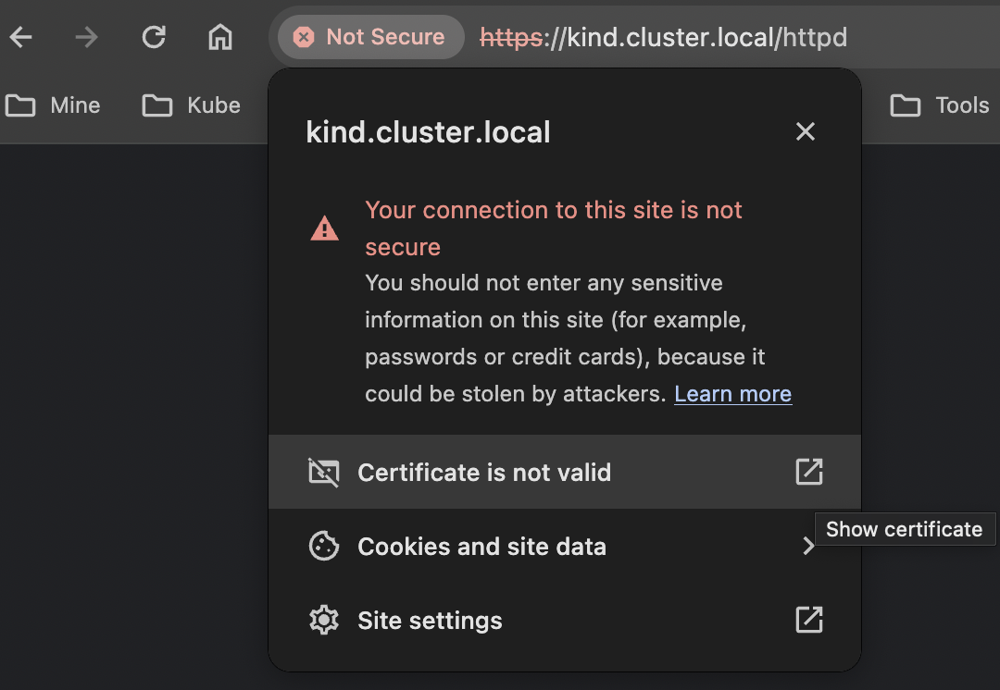
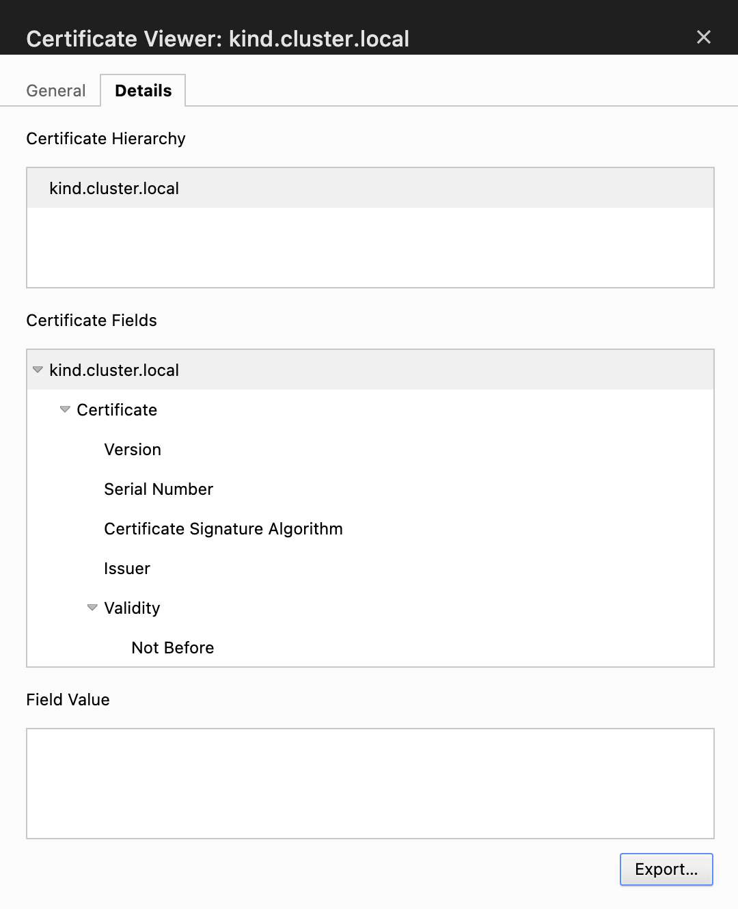
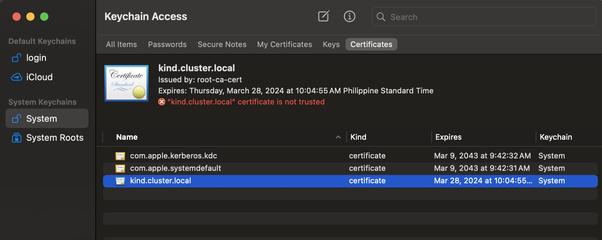
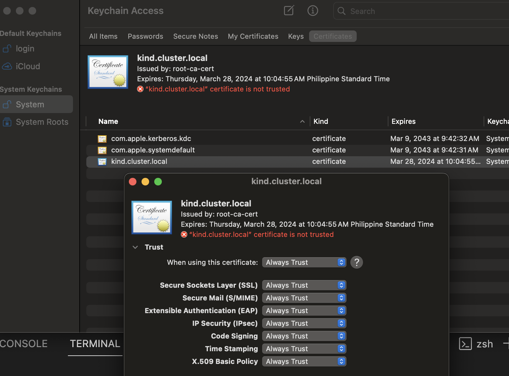
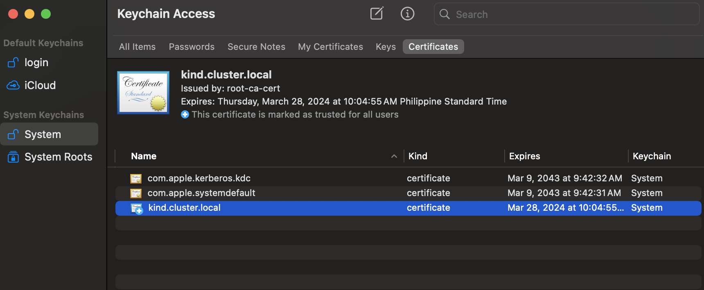
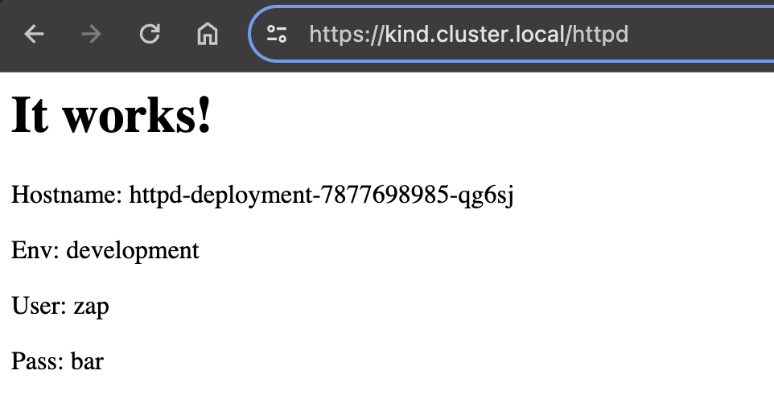

## Setting Up Self-Signed HTTPS Access To Local Dev K8s Cluster in Kind

#### Prerequisites:
- Working `Kind` cluster. (See provided terraform)
- Installed `cert-manager`. (Installed via helm in the provided terraform)
- Manifest files for creating a self-signed cert. (below included in the `httpd.yaml` example)
  ```
  ---
  apiVersion: cert-manager.io/v1
  kind: ClusterIssuer
  metadata:
    name: root-ca-issuer
  spec:
    selfSigned: {}
  ---
  apiVersion: cert-manager.io/v1
  kind: Certificate
  metadata:
    name: root-ca-cert
  spec:
    isCA: true
    commonName: root-ca-cert
    subject:
      organizations:
        - Kind Cluster Inc.
      organizationalUnits:
        - Kind
    secretName: root-ca-cert-secret
    dnsNames:
      - "*.cluster.local"
    privateKey:
      algorithm: ECDSA
      size: 256
    issuerRef:
      name: root-ca-issuer
      kind: ClusterIssuer
      group: cert-manager.io
  ---
  apiVersion: cert-manager.io/v1
  kind: ClusterIssuer
  metadata:
    name: ca-issuer
  spec:
    ca:
      secretName: root-ca-cert-secret
  ```

### To run deployment example
```
# NOTE: example using custom 'kubeconfig' location

kubectl --kubeconfig ~/.kind_kube/config <path to example dir>/httpd.yaml
```

### To `trust` the generated self-signed certificate from the example (*** Mac only ***)
As the certificate used to secure your HTTPS endpoint is a self-signed certificate, your web browser won’t recognise it until you change the system setting to make your local machine to trust the certificate.

On a Mac, you can follow the steps below:

- Navigate the google chrome to your test domain.
- Once you see the warnings for untrusted certificates, you can click the `Not Secure` button in the address bar and click the "Certificate is not valid" item from the menu popup.

- On the `Certificate Viewer` window, download the certificate file. Select the `Export` button to download. 
- Open `Keychain Access` app.
Select `System` under `System Keychains` heading and select `Certificates` under `Keychain Access`.
- Drag & drop the previously downloaded certificate file to the right panel.  
- Select the certificate & click the `Get Info` menu from the pop up. 
- Select `Always Trust` from the `Trust` section. 
- Close window after selecting `Always Trust`. 
- Test page should now be loading fine via `https`. 

